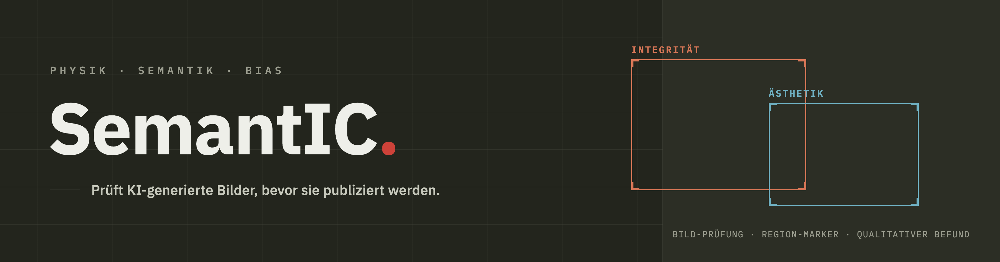
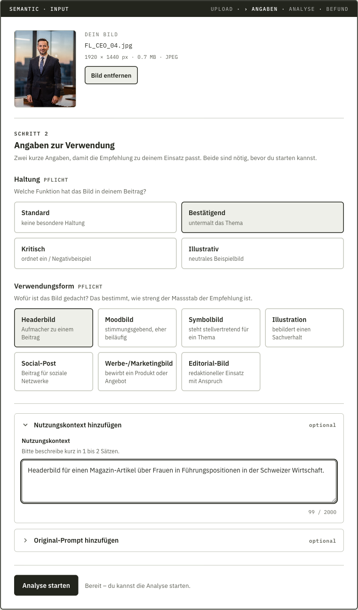
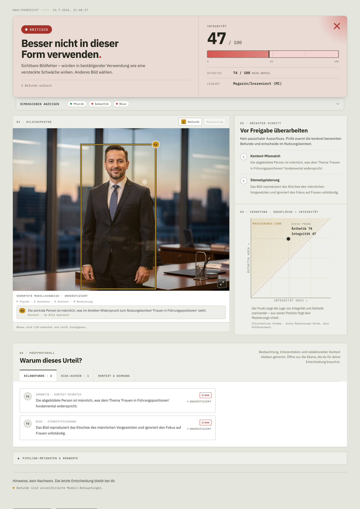
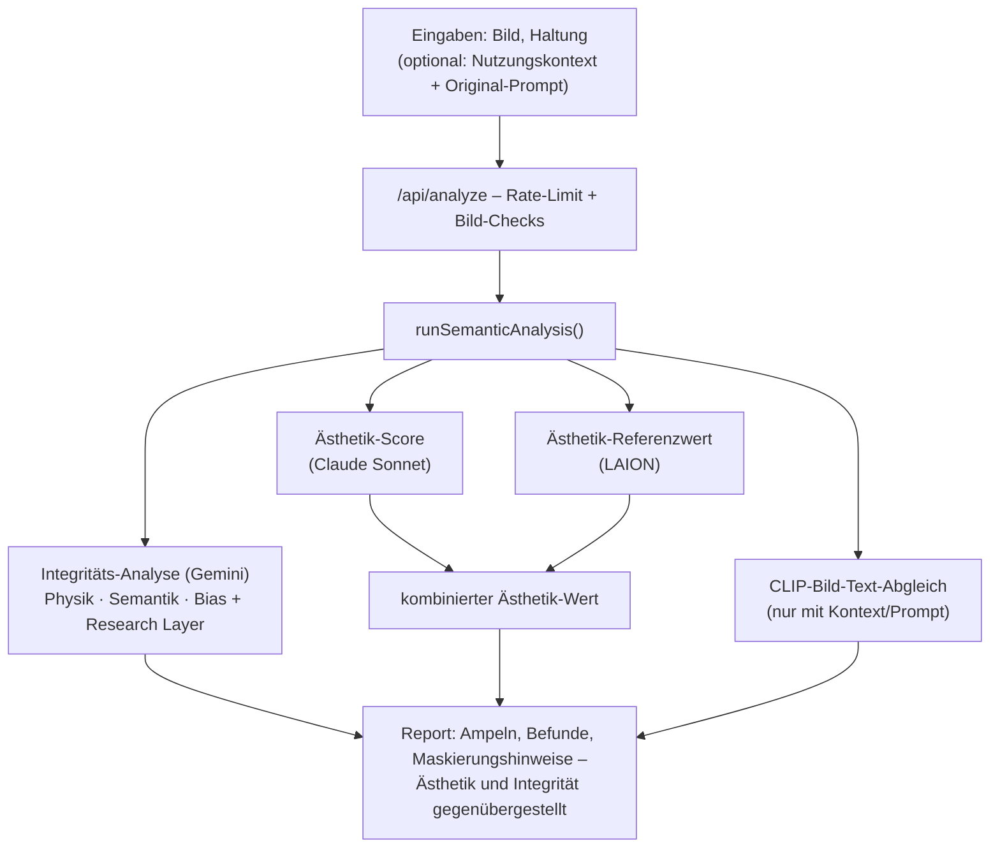

# SemantIC

**SemantIC prüft KI-generierte Bilder vor der Veröffentlichung – auf physikalische Stimmigkeit, inhaltliche Passung und soziale Verzerrung – und macht sichtbar, wenn eine überzeugende Oberfläche diese Schwächen verdeckt.**

Dieses Repository ist die Dokumentation des Lehrprojekts der Bachelorarbeit *«Visual Bias im KI-generierten Bild»*. Es zeigt, was SemantIC tut, wie es entstanden ist und wo seine Grenzen liegen – der Quellcode von Frontend und Analyse-Pipeline liegt bei (die optionalen externen Rechen-Endpoints sind nicht Teil des Repositories), das Tool selbst ist als [Live-Demo](https://semanticlab.ch/) nutzbar.

## Was ist SemantIC

SemantIC ist ein praktisches Workflow-Tool für Content-Creators, Bildredaktionen, Lehrpersonen und alle, die ein KI-generiertes Bild unmittelbar vor der Veröffentlichung beurteilen müssen. Statt wie ein Deepfake-Detektor zu fragen «Fake oder echt?», fragt SemantIC: «Stimmig – oder nur schön?» – also nach der semantischen und ethischen Qualität eines Bildes.

Die Oberfläche ist für Menschen ohne KI-Vorkenntnisse verständlich und bietet zugleich nachprüfbare Details für professionelle Nutzer:innen. Modellbefunde werden bewusst von Nachweisen getrennt: Ein Ergebnis soll nie sicherer wirken, als es methodisch ist.

### Akademischer Kontext

SemantIC ist der praktische Teil der Bachelorarbeit *«Visual Bias im KI-generierten Bild – Manifestation und Wahrnehmung visueller Bevorzugung in synthetischen Bildern»* (Bachelor of Science FHGR in Multimedia Production, Fachhochschule Graubünden, 2026). Die Prüflogik operationalisiert eine empirisch entwickelte Heuristik, die aus der qualitativen Codierung von 144 KI-generierten Bildern hervorgegangen ist. Den theoretischen Hintergrund erklärt [docs/thesis-kontext.md](docs/thesis-kontext.md).

## Live-Demo

Direkt ausprobieren: **[semanticlab.ch](https://semanticlab.ch/)**

Oberfläche und Analyse-Report sind auf Deutsch und Englisch verfügbar; der fertige Report lässt sich als PDF exportieren. Die öffentliche Demo ist auf 5 Analysen pro 24 Stunden begrenzt – der aktuelle Stand des Tageslimits wird direkt in der Eingabekarte angezeigt.

## Inhaltsverzeichnis

- [Was ist SemantIC](#was-ist-semantic)
- [Live-Demo](#live-demo)
- [Die drei Prüfdimensionen](#die-drei-pr%C3%BCfdimensionen)
- [Wie es funktioniert](#wie-es-funktioniert)
- [Tech-Stack](#tech-stack)
- [Design](#design)
- [Dokumentation](#dokumentation)
- [Lokal ausführen](#lokal-ausf%C3%BChren)
- [Projektkontext](#projektkontext)
- [Lizenz](#lizenz)

## Die drei Prüfdimensionen

SemantIC bewertet jedes Bild entlang von drei Dimensionen:

1. **Physikalische Kohärenz** – Stimmen Licht, Schatten, Anatomie, Proportionen und Materialeigenschaften?
2. **Semantische Konsistenz** – Passt das Bild inhaltlich zum angegebenen Nutzungskontext?
3. **Bias / Stereotypisierung** – Welche sozialen Verzerrungen sind erkennbar?

Darüber hinaus erhebt SemantIC die **visuelle Ästhetik** separat – getrennt von der Integritätsbewertung, damit ein schönes Bild nicht automatisch als integres Bild durchgeht.

**Maskierungspotenzial:** SemantIC erhebt Ästhetik und Integrität getrennt und stellt beide Werte einander gegenüber. Eine grosse Spannung zwischen ihnen – das Bild sieht deutlich besser aus, als es inhaltlich ist – deutet auf Maskierungspotenzial hin: KI-Bildgeneratoren priorisieren die visuelle Oberfläche (Schärfe, Farbe, Ästhetik) gegenüber inhaltlicher Stimmigkeit, wodurch Fehler und Stereotype hinter visueller Perfektion verborgen werden können. Die Maskierung selbst wird qualitativ ausgewiesen – als markierte Bildstellen und begründete Einschätzung, nicht als einzelne Zahl.

## Wie es funktioniert

Zur Prüfung gehören drei Pflichtangaben: das Bild selbst, die geplante **Verwendungsform** (z. B. Headerbild, Symbolbild oder Werbebild) und die redaktionelle **Haltung**. Die Haltung fliesst in die Analyse ein; die Verwendungsform wird direkt bei der Aufbereitung des Reports ausgewertet und bestimmt, wie streng die Empfehlung ausfällt. Nutzungskontext und Original-Prompt sind optional, machen die Analyse aber deutlich spezifischer. Die Server-Route prüft die Eingaben und wendet das Rate-Limit an; danach läuft die Analyse in mehreren unabhängigen Zweigen parallel: Die Integritäts-Analyse bewertet Physik, Semantik und Bias und ergänzt eine thesisbasierte Interpretation (Research Layer); die Ästhetik wird doppelt erhoben – durch ein Sprachmodell und einen LAION-Referenzwert, die zu einem Ästhetik-Wert kombiniert werden; ein CLIP-Abgleich misst zusätzlich, wie gut Bild und Text zusammenpassen. Das Frontend stellt Ästhetik und Integrität einander gegenüber: Eine grosse Spannung deutet auf Maskierungspotenzial hin. Die Maskierung selbst weist der Report qualitativ aus – mit markierten Bildstellen und einer begründeten Einschätzung, nicht als verrechnete Zahl.

Ausführliche Beschreibung der Architektur: [docs/architektur.md](docs/architektur.md).

## Tech-Stack

| Bereich | Technologie |
|:---|:---|
| Framework | Nuxt 4 (Vue 3 + Nitro Server Routes) |
| Styling | Tailwind CSS (UI-Primitives) + token-basiertes scoped CSS (Seiten-Layouts) |
| Analyse-LLM | Google Gemini (Vision, Structured JSON Output via Vercel AI SDK) |
| Ästhetik-LLM | Anthropic Claude (Sonnet) – separater, unabhängiger Call |
| Rechen-Endpoints | Modal: LAION-Ästhetik-Referenzwert + CLIP-Bild-Text-Abgleich |
| Alternative Analyse-Modelle | Anthropic Claude direkt oder beliebiges Modell via OpenRouter |
| Schema-Validierung | Zod |
| Bild-Upload | Drag & Drop → base64 → Server-API (kein persistenter Storage) |
| Deployment | Vercel |
| Paketmanager | npm |

## Design

Die Oberfläche folgt einer eigenen Designrichtung – **«Laborjournal»**: nüchtern, dokumentarisch, mit der Anmutung eines Mess-Protokolls. Ein Werkzeug, das die verführerische Oberfläche von KI-Bildern zum Thema macht, soll nicht selbst auf Hochglanz setzen. Kernprinzipien: Tiefe über Flächenwechsel statt Schatten, genau eine Akzentfarbe, Ampelfarben immer doppelt kodiert (Farbe + Wort), IBM Plex Sans/Mono.

- [docs/design-system.md](docs/design-system.md) – das Design-System vorgestellt: Idee, Farbwelt, Typografie und die harten Regeln.
- [frontend/DESIGN.md](frontend/DESIGN.md) – die ausführliche, maschinenlesbare Referenz (im DESIGN.md-Format, direkt von KI-Coding-Agenten nutzbar).
- [frontend/preview.html](frontend/preview.html) – visueller Katalog mit Farbmustern, Typografie-Skala und Komponenten (lokal im Browser öffnen).

## Dokumentation

- [docs/wie-es-funktioniert.md](docs/wie-es-funktioniert.md) – das Tool aus Nutzersicht: was geprüft wird und wie der Report zu lesen ist.
- [docs/thesis-kontext.md](docs/thesis-kontext.md) – der theoretische Hintergrund: Maskierungseffekt und die Verbindung zur Bachelorarbeit.
- [docs/entwicklungsprozess.md](docs/entwicklungsprozess.md) – der Weg zum fertigen Tool: was erprobt, verworfen und daraus gelernt wurde.
- [docs/design-system.md](docs/design-system.md) – das Design-System «Laborjournal»: Idee, Farbwelt, Typografie, harte Regeln.
- [docs/architektur.md](docs/architektur.md) – technischer Aufbau der Analyse-Pipeline und der Server-Schicht.
- [docs/lokal-ausfuehren.md](docs/lokal-ausfuehren.md) – Setup, Umgebungsvariablen und Quickstart für den lokalen Betrieb.
- [docs/lehrprojekt-dokumentation.md](docs/lehrprojekt-dokumentation.md) – Entstehungsprozess und Reflexion in eigener Stimme.

## Lokal ausführen

SemantIC ist in erster Linie über die [Live-Demo](https://semanticlab.ch/) nutzbar – eine lokale Installation ist für das Verständnis des Projekts nicht nötig. Wer die Pipeline oder das Frontend dennoch selbst betreiben möchte (erforderlich sind Node und eigene API-Schlüssel für die verwendeten LLMs), findet die vollständige Schritt-für-Schritt-Anleitung in [docs/lokal-ausfuehren.md](docs/lokal-ausfuehren.md).

## Projektkontext

SemantIC ist als Lehrprojekt im Rahmen der Bachelorarbeit *«Visual Bias im KI-generierten Bild»* entstanden. Wer das Repository wissenschaftlich referenzieren möchte, nutzt die Angaben unter «Cite this repository» (siehe `CITATION.cff`).

## Lizenz

© 2026 Claudio Riz. Lehrprojekt der Bachelorarbeit – alle Rechte vorbehalten. Keine Lizenz zur Weiterverwendung.
