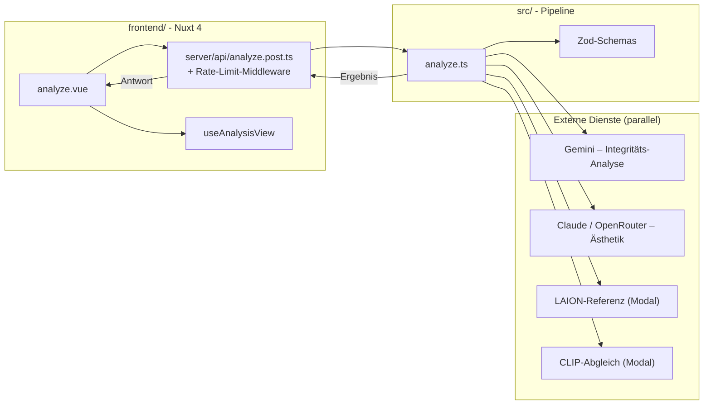

# Architektur

SemantIC ist ein AI Visual Integrity Validator: ein Tool, das KI-generierte Bilder vor der Publikation auf physikalische Kohärenz, semantische Konsistenz und Bias prüft. Dieses Dokument beschreibt die technische Referenzschicht – wie die Pipeline aufgebaut ist, welche Felder der Analyse-Output trägt und wie ein Bild vom Upload bis zum Report fliesst. Jede Aussage hier ist gegen den Code in `src/` und `frontend/` belegt.

## Überblick

Das System hat drei Schichten: ein Nuxt-4-Frontend (`frontend/`), eine framework-agnostische Analyse-Pipeline (`src/`) und externe Dienste. Das Frontend nimmt das Bild entgegen, eine Server-Route validiert die Eingabe und ruft die Pipeline auf, die ihrerseits vier Aufrufe parallel ausführt: zwei LLM-Calls (Analyse und Ästhetik) sowie zwei optionale Rechen-Endpoints (LAION-Ästhetik-Referenz und CLIP-Bild-Text-Abgleich).

Die Knoten- und Dateinamen im Diagramm wurden gegen den Code geprüft und stimmen überein: `frontend/app/pages/analyze.vue`, `frontend/app/composables/useAnalysisView.ts`, `frontend/server/api/analyze.post.ts`, `frontend/server/middleware/ratelimit.ts`, die Pipeline-Einstiegsfunktion in `src/analyze.ts` mit den Zod-Schemas in `src/schemas/` sowie die Clients der Rechen-Endpoints in `src/aesthetic-modal.ts` und `src/clip-alignment-modal.ts`. Die Pipeline wird in `frontend/` über den Alias `@pipeline` (→ `../src`, definiert in `frontend/nuxt.config.ts`) importiert.

Die Pipeline ist über das CLI in `src/cli.ts` (`npm run spike -- <bildpfad>`) auch ohne Frontend lauffähig; sie ist bewusst von der Web-Schicht entkoppelt.

## Analyse-Pipeline

Der Einstiegspunkt ist `runSemanticAnalysis()` in `src/analyze.ts`. Pro Bild laufen zwei voneinander unabhängige LLM-Calls plus zwei externe Nebencalls über ein gemeinsames `Promise.all` parallel:

- **Call 1 – Integritäts-Analyse:** ein einziger LLM-Call, der vier Aufgaben in einem Schema-Output abdeckt (Bias-Achsen-Ableitung, Bildanalyse über die drei Dimensionen, Research-Layer-Zuordnung, LLM-Integritäts-Score). Prompt-Quelle: `src/prompts/analysis.en.ts` (Default Englisch) bzw. `src/prompts/analysis.ts` (Deutsch), gesteuert über `promptLang` (Prompt-Sprache; Default `'en'`, Konstante `DEFAULT_PROMPT_LANG`). Davon unabhängig steuert `outputLang` (Default `'de'`, Konstante `DEFAULT_OUTPUT_LANG`) die Sprache der LLM-Freitexte und der deterministisch komponierten Report-Texte.
- **Call 2 – Ästhetik-Score:** ein separater LLM-Call (Prompt `src/prompts/aesthetic.ts`), der nur die visuelle Oberfläche bewertet und ein schmales Schema (`AestheticSchema`) zurückgibt. Methodisch bewusst getrennt, damit der Ästhetik-Befund die Integritäts-Bewertung nicht beeinflusst. Default-Modell: `anthropic:claude-sonnet-5` (Konstante `DEFAULT_AESTHETIC_MODEL`).
- **Externe Nebencalls (parallel, best effort):** `runModalAesthetic()` (LAION-Ästhetik) und `runClipAlignment()` (CLIP-Abgleich von Prompt/Kontext gegen das Bild). Beide sind in `try`/`catch`-Pfade gekapselt; ein Fehler bricht die Analyse nicht ab, sondern landet als `*_error` im `meta`-Objekt. Der CLIP-Call wird übersprungen, wenn weder Prompt noch Kontext gesetzt sind.

Nach dem `Promise.all` durchläuft das Analyse-Ergebnis (Call 1) eine Reihe **deterministischer Nachbearbeitungsschritte** im TypeScript – das sind Anwendungsregeln, keine zweiten LLM-Befunde. Die im Code tatsächlich vorhandenen Schritte, in Ausführungsreihenfolge:

| Schritt | Funktion in `analyze.ts` | Was er tut |
|:---|:---|:---|
| Evidenz-Filter | `applyEvidenceFilter` | Prüft pro Codebook-Befund-Flag (`has_physics_issue`/`has_anatomy_issue`/`has_context_issue`), ob mindestens ein gültiger Evidenz-Eintrag (valide Bounding-Box + Mindest-Beobachtungslänge) vorliegt. Ohne valide Evidenz wird das Flag auf `false` gesetzt und ungültige Evidenz verworfen. |
| Maskierungs-Evidenz-Filter | `applyMaskingEvidenceFilter` | Verwirft `masking_evidence`-Einträge, deren Box ungültig ist, deren Beschreibung zu kurz ist, deren `codebook_link` kein aktives Flag hat, deren Treiber nicht in `visual_drivers` vorkommt oder deren Region keine Codebook-Evidenz-Region überlappt. |
| Konsistenz-Reconcile | `applyConsistencyReconcile` | Bringt Codebook-Flags und Dimensions-Scores in Einklang. Reklassifiziert Anatomie-Findings und setzt Score-Caps (max. 74) auf einzelne Dimensionen, wenn ein Flag mit Evidenz und einem mindestens mittelschweren Finding zusammentrifft. Schreibt einen Audit-Trail (`applied_rules`, `score_caps`, `flag_changes`). |
| Status aus Score | `applyStatusFromScore` / `deriveStatus` | Leitet die Ampel (`green`/`yellow`/`red`) jeder Dimension deterministisch aus dem finalen Score ab (Schwellen 75/55). Der vom LLM separat gelieferte Status wird damit überschrieben, weil LLMs Score und Status gelegentlich widersprüchlich setzen. |
| Intent-Reparatur | `repairIntentAssessment` | Erzwingt, dass `declared_intent` exakt der vom Nutzer erklärten Haltung entspricht, und setzt `intent_alignment` auf `not_assessable`, wenn keine Haltung angegeben ist. |
| Normative-Maskierung-Reparatur | `repairNormativeMasking` | Deterministische Sanity-Regeln für `research_layer.normative_masking` (z. B. Verdict-Normalisierung bei leerer bzw. inflationärer Aspekt-Liste). Scope hart auf dieses eine Feld begrenzt. |
| Fehlertyp-Reconcile | `reconcileDominantErrorType` | Normalisiert `dominant_error_type` gegen die – nach allen vorigen Schritten gültigen – Codebook-Flags. Greift nur bei Inkonsistenz. |
| Lokaler Integritäts-Score | `computeIntegrityScore` (in `src/scoring.ts`) | Bildet das gerundete Mittel der drei Dimensions-Scores. |
| Aggregat-Cap | `applyAggregateCap` | Deckelt den lokalen Integritäts-Score, wenn ein Dimension-Cap getriggert hat, der Aggregat-Score aber über der Schwelle liegt (Score-Hygiene). |

Aus dem bereinigten Analyse-Ergebnis werden zwei weitere deterministische Artefakte gebildet:

- **`composeMaskingReviewNote()`** (`src/masking-note.ts`) erzeugt aus Leseart und gefilterter `masking_evidence` einen beschreibenden Maskierungs-Hinweis (Text + Basis-Metadaten), keinen Zahlenwert.
- **`deriveContextReviewHints()`** (`src/context-hints.ts`) leitet regelbasierte Prüfhinweise aus Leseart, visuellen Treibern, Scores und Codebook-Flags ab.

## Output-Schema

`runSemanticAnalysis()` gibt ein `SemanticAnalysisResult` zurück (Typ in `src/analyze.ts`). Die Hauptfelder:

| Feld | Quelle | Inhalt |
|:---|:---|:---|
| `analysis.dimension_analysis` | `AnalysisSchema`, `src/schemas/analysis.ts` | Die drei Dimensionen `physics`, `semantics`, `bias`, je mit `score`, `status` und `findings[]`. |
| `analysis.bias_axis_analysis` | `AnalysisSchema` | Abgeleitete Bias-Achsen mit Relevanz, Risiko, Confidence und Codebook-Zuordnung; `no_axes_reason` für den Nullfall. |
| `analysis.research_layer` | `AnalysisSchema` | Leseart (`reading_mode`), visuelle Treiber, `dominant_error_type`, das `codebook`-Objekt (u. a. `has_*`-Flags, `*_evidence`, `stereotype_intensity`), `masking_evidence[]`, `normative_masking` und `provenance_markers[]` (rein deskriptive Overlay-Markierungen, kein Befund). |
| `analysis.integrity_score_llm` | `AnalysisSchema` | Der vom LLM gelieferte Integritäts-Score mit Begründung (nicht der finale lokale Score). |
| `analysis.intent_assessment` | `AnalysisSchema` | `declared_intent`, `intent_alignment`, `framing_risk` und Begründung. |
| `aesthetic` | `AestheticSchema` | Der Ästhetik-Score aus Call 2. |
| `computed` | `analyze.ts` | Berechnete Endwerte: `integrity_score_local` (gemittelt, ggf. gecappt) sowie `aesthetic_combined` samt Herkunftsangabe – kombiniert aus LLM-Bewertung und externem Ästhetik-Nebencall, oder nur die LLM-Bewertung, falls der Nebencall ausfiel. |
| `context_review_hints` | `context-hints.ts` | Regelbasierte Prüfhinweise. |
| `masking_review_note` | `masking-note.ts` | Beschreibender Maskierungs-Hinweis (Text), oder `null`. |
| `meta` | `analyze.ts` | Modell-Labels, Laufzeit, die verwendeten Sprachen (`meta.prompt_lang`, `meta.output_lang`), die Audit-Reports der Filter-/Reconcile-Schritte sowie die Ergebnisse bzw. Fehler der externen Nebencalls. |

Hinweis zum Schema: `findings[]` enthält ausschliesslich Probleme; saubere Dimensionen liefern ein leeres Array. `normative_masking` ist laut Schema-Beschreibung explizit unabhängig von den Codebook-Flags und darf Scores, Severities oder Leseart nicht beeinflussen.

`provenance_markers[]` ist eine rein deskriptive Transparenz-Annotation: Sichtbare Overlays im Bild – Wasserzeichen, Logos oder Signaturen – werden mit Typ, Bildregion und Konfidenz erfasst (maximal drei Einträge, optional). Das Feld ist ausdrücklich kein Echtheits- oder Herkunfts-Urteil und fliesst in keinen Score ein. Das Frontend zeichnet die Marker als von den Befund-Spots getrennte Overlay-Markierungen im Bild-Inspektor und weist sie auch im Druck-Report aus.

## End-to-End-Datenfluss

1. Nutzer lädt auf `frontend/app/pages/analyze.vue` ein Bild hoch (Drag & Drop → Base64), wählt die beiden Pflichtangaben Verwendungsform und redaktionelle Haltung und ergänzt optional Nutzungskontext und Original-Prompt. Die Haltung wird an die Pipeline gesendet; die Verwendungsform bleibt frontend-only und rahmt später die Empfehlung im View-Model.
2. Das Frontend sendet `POST /api/analyze`. Davor greift die Rate-Limit-Middleware (`frontend/server/middleware/ratelimit.ts`).
3. `frontend/server/api/analyze.post.ts` validiert die Eingabe in mehreren Stufen (Content-Length-Hardstop, Zod-Body-Schema, Base64-Strip, Magic-Byte-/MIME-/Pixel-Prüfung) und richtet einen Server-`AbortController` mit Timeout und Disconnect-Handler ein.
4. Die Route ruft `runSemanticAnalysis()` über den `@pipeline`-Alias auf und übergibt den per Magic-Byte verifizierten `mediaType` (nicht das Client-Feld) sowie die Report-Sprache (`outputLang` aus dem validierten Request-Body; das Frontend friert sie zu Analysebeginn ein). Die Lesearten- und Treiber-Labels stammen dabei ausschliesslich aus `src/vocab.ts` – das LLM liefert nur neutrale Codes.
5. Die Pipeline führt Call 1, Call 2 und die externen Nebencalls parallel aus.
6. Die deterministischen Nachbearbeitungsschritte (Evidenz-Filter, Maskierungs-Filter, Konsistenz-Reconcile, Status-aus-Score, Intent-/Normative-Reparatur, Fehlertyp-Reconcile, lokaler Score, Aggregat-Cap) laufen über das Ergebnis.
7. Die Pipeline gibt das `SemanticAnalysisResult` an die Route zurück, die es als JSON-Antwort sendet.
8. Im Frontend übersetzt `useAnalysisView` (`frontend/app/composables/useAnalysisView.ts`) das JSON in ein View-Model und rendert den Report über visuelle Komponenten – kein LLM-Fliesstext in der Hauptansicht.

## Multi-Provider

Welcher Provider den Analyse-Call ausführt, entscheidet `resolveModel()` in `src/analyze.ts` anhand eines Prefix im Modell-String (im CLI über `--model` steuerbar):

| Prefix | Beispiel | Modus |
|:---|:---|:---|
| *(kein)* | `gemini-3-flash-preview` | Gemini über `@ai-sdk/google`, `generateObject` mit nativem JSON-Schema (`AnalysisSchema`). |
| `anthropic:` | `anthropic:claude-sonnet-5` | Claude über `@ai-sdk/anthropic`, `generateText` + JSON-Skeleton im Prompt. |
| `openrouter:` | `openrouter:[vendor/model]` | OpenRouter über `@ai-sdk/openai` (mit `baseURL` auf OpenRouter), `generateText` + JSON-Skeleton im Prompt. |

Der Unterschied liegt im `useTextFallback`-Flag: Bei Gemini (`false`) läuft `generateObject`, das die Vercel-AI-SDK direkt aus dem Zod-Schema eine JSON-Grammatik erzeugen lässt. Für Anthropic und OpenRouter (`true`) wird `generateText` verwendet – dem System-Prompt wird ein explizites JSON-Skeleton (`ANALYSIS_JSON_SKELETON` bzw. die EN-Variante) plus ein JSON-Suffix angehängt, und das Ergebnis wird per `parseWithFallback()` aus dem Text extrahiert und mit Zod validiert. Sampling-Parameter werden providerabhängig gesetzt (`buildSampling`), mit drei Fällen: Adaptive-Thinking-Modelle (Claude Sonnet 5, Opus 5, Opus 4.7/4.8 – darunter das Default-Ästhetik-Modell) erhalten gar keine Sampling-Parameter, weil sie Nicht-Default-Sampling mit HTTP 400 ablehnen. Text-Fallback-Provider erhalten nur `temperature` und `topK`. Alle übrigen (Gemini) erhalten den vollen Parametersatz.

## Security-Schicht

Die Schutzmechanismen sind als Defense-in-Depth über Middleware und Route verteilt. Konkrete Schwellenwerte und die Bypass-Mechanik werden hier bewusst nicht im Detail genannt.

- **Rate-Limit (`frontend/server/middleware/ratelimit.ts`):** Nur `POST /api/analyze` wird limitiert; andere Routen laufen durch. Das Limit ist IP-basiert (Upstash-Ratelimiter). Fehlt die Konfiguration, gilt im lokalen Dev ein offener Fallback, in Produktion wird mit `503` abgewiesen.
- **Bypass-Token:** Ein gültiger Bypass-Cookie (HMAC-verifiziert, Logik in `frontend/server/utils/bypass`) überspringt das Limit. Details der Verifikation sind hier ausgespart.
- **Content-Length-Hardstop (`analyze.post.ts`):** Übergrosse Anfragen werden vor dem Body-Parse mit `413` abgewiesen.
- **Body-Validierung (`frontend/server/utils/validate.ts`):** Striktes Zod-Schema (`AnalyzeBodySchema`) mit `.strict()` lehnt unbekannte Keys ab und begrenzt die Base64-Länge sowie die Textfelder. Ungültige Bodies → `422`.
- **Magic-Byte-Check + MIME-Whitelist (`sniffImage`):** Der Bildtyp wird aus den Bytes ermittelt, nicht aus dem Client-`mediaType`-Feld. Nur eine feste Liste von Bildtypen ist zulässig; andere → `415`.
- **Pixel-Limit:** Bilder, deren Kantenlänge ein Maximum überschreitet, werden mit `413` abgewiesen.
- **Abort/Timeout:** Ein Server-`AbortController` bricht den Pipeline-Call bei Timeout oder Client-Disconnect ab (Kostenschutz); Timeout → `504`, Provider-Fehler → `502`.
- **Log-Hygiene:** Roher LLM-Text wird in Produktion standardmässig nicht geloggt (nur bei explizitem Debug-Opt-in über `SEMANTIC_DEBUG_RAW=1`); bei Pipeline-Fehlern wird nur die Fehlerklasse protokolliert.

## Maskierung ist kein Messwert

Der Maskierungseffekt – die These, dass visuelle Perfektion semantische oder ethische Fehler überdecken kann – wird im Tool **nicht als Zahl** behauptet. Frühere Felder `masking_score` und `masking_verdict` wurden entfernt (siehe Kommentar in `src/scoring.ts` und `src/masking-note.ts`).

Stattdessen wird Maskierung an zwei Stellen sichtbar gemacht:

- **Im Frontend als Spannung** zwischen Ästhetik und Integrität: Ein Bild mit hohem Ästhetik-Score, aber niedrigem Integritäts-Score zeigt genau das Muster, das die These beschreibt. Diese Spannung wird visuell aufgemacht, nicht zu einem Differenzwert verrechnet, der als Befund auftreten würde. Im View-Model (`useAnalysisView.ts`) gibt es keinen Differenz- oder Quadrant-Wert: `integrityScore` und `aestheticCombined` sind zwei separate Felder, die im Diagnose-Cockpit nebeneinander dargestellt werden, ohne Verrechnung. Ein Maskierungs-Hinweis erscheint nur, wenn validierte `masking_evidence`-Verknüpfungen vorliegen – die Konstellation «hohe Ästhetik + niedrige Integrität» allein löst bewusst nichts aus. Das einzige Delta im View-Model (`aestheticDelta`, Schwelle 20) misst etwas anderes: die Divergenz der beiden Ästhetik-Quellen (Sonnet vs. LAION), nicht das Verhältnis von Ästhetik zu Integrität.
- **Als `masking_review_note`:** ein deterministisch komponierter, rein **beschreibender** Hinweis (`composeMaskingReviewNote` in `src/masking-note.ts`). Er ist sprachlich modal formuliert (z. B. «kann … erschweren»), nennt keine Stufenwörter und keinen Score; Zahlen erscheinen nur als ehrliche Anzahl markierter Stellen, nicht als Bewertung. Das Feld kann `null` sein.

Damit folgt die Architektur dem Grundsatz, Maskierung erklärbar zu machen, statt sie als Messgrösse zu suggerieren.
