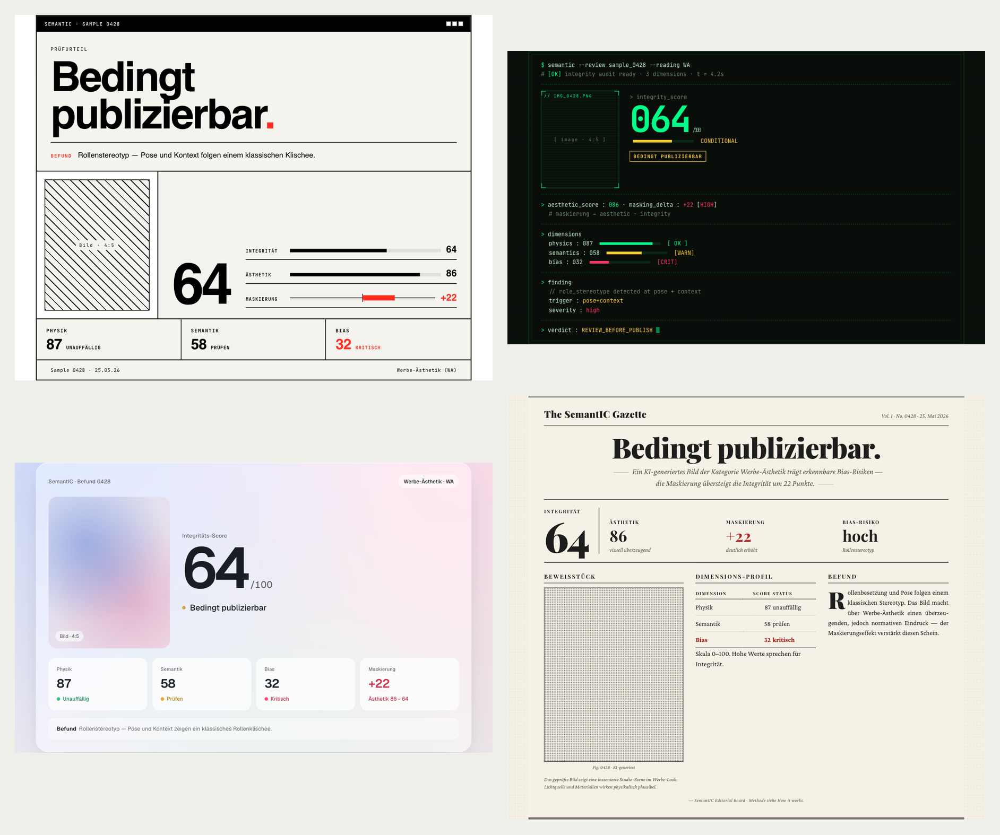
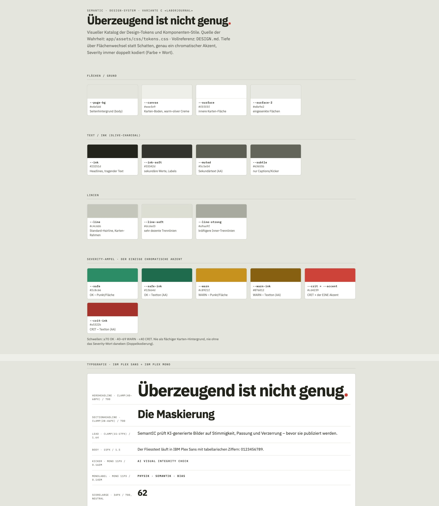

# SemantIC – Lehrprojekt-Dokumentation

*Projektdokumentation zum Lehrprojekt der Bachelorarbeit «Visual Bias im KI-generierten Bild», Multimedia-Production, FH Graubünden.*

Diese Dokumentation zeigt, wie mein Lehrprojekt (SemantIC) entstanden ist. Von der ersten Idee bis zum fertigen Werkzeug. Im Zentrum steht der Weg zum fertigen Prototypen, welche Ziele ich mir gesetzt habe, wie ich gearbeitet habe, was funktioniert hat, was nicht und was ich daraus gelernt habe. Eine genauere Übersicht über alle erprobten und verworfenen Ansätze bietet die Dokumentation [Entwicklungsprozess & Verworfenes](entwicklungsprozess.md). Die technischen Details finden sich in der [Architektur-Dokumentation](architektur.md). Beide Dokumente und der vollständige Code sind im öffentlichen GitHub-Repository verfügbar: [github.com/Dune005/SemantIC](https://github.com/Dune005/SemantIC).

*Diese Dokumentation liegt auch als gestaltetes PDF vor: [SemantIC-Lehrprojekt-Dokumentation.pdf](SemantIC-Lehrprojekt-Dokumentation.pdf)*

## Was ist SemantIC

SemantIC ist eine Web-Plattform, mit der Medienschaffende KI-generierte Bilder vor der Veröffentlichung auf ihre inhaltliche Stimmigkeit prüfen können. Man lädt ein Bild hoch, gibt den vorgesehenen Verwendungszweck an und erhält eine strukturierte Analyse in drei Dimensionen:

1. **Physikalische Kohärenz:** Stimmen Licht, Schatten, Spiegelungen, Anatomie und Proportionen?
2. **Semantische Konsistenz:** Ergibt die Szene Sinn und passt das Bild zum angegebenen Verwendungszweck?
3. **Bias und Stereotypisierung:** Welche Rollenbilder, Posen und Klischees zeigt das Bild, und sind sie im gegebenen Kontext problematisch?

Wichtig ist auch, was SemantIC *nicht* ist: ein «Fake oder echt»-Detektor. Solche Werkzeuge gibt es bereits. SemantIC stellt eine andere Frage: Ist dieses Bild stimmig oder nur schön?

Die Live-Demo ist unter [semanticlab.ch](https://semanticlab.ch) verfügbar. Nach der Prüfung lassen sich die Ergebnisse als PDF exportieren. Pro Tag können höchstens fünf Bilder analysiert werden, da jede Prüfung zwei kostenpflichtige KI-Anfragen auslöst. Für die Dozierenden gibt es einen unbegrenzten Demozugang.

## Wie es zu SemantIC kam

SemantIC war nicht die Ausgangsidee meines Lehrprojekts. Im Herbst 2025 suchte ich zunächst nach einem Thema, das zu meinen bisherigen Schwerpunkten passte. Besonders gern arbeitete ich an Projekten, bei denen ich selbst programmieren konnte und daneben interessierte mich die Arbeit mit Bildern. Für die Bachelorarbeit wollte ich diese praktischen Interessen mit den medienethischen Fragen rund um künstliche Intelligenz verbinden. Meine ersten Ideen waren dementsprechend sehr breit gefächert. Die Optionen reichten von digitalen Manipulationsformen bis zu verschiedenen interaktiven Anwendungen. Ein konkretes Produkt stand damals aber noch nicht fest.

Mehrere Ansätze drehten sich zunächst um Desinformation und Fake Content. Durch die Beschäftigung mit «AI Slop» verschob sich mein Fokus allmählich. Mich interessierte nicht mehr nur, ob ein Inhalt echt oder künstlich erzeugt war, sondern wichtiger wurde seine Qualität.

Die erste konkrete Idee war der «SmartImageFinder». Das geplante Tool sollte Projektbeschreibungen auswerten, daraus Suchbegriffe ableiten und passende Bilder auf Stockplattformen vorschlagen. Beim Abgleich mit meiner Forschungsfrage wurde mir klar, dass der Kern des Projekts weiterhin die Bildsuche war, was nicht so ganz zum Thema passte.

Der Wechsel zu SemantIC begann mit den ersten Recherche-Runden zum Thema meiner Thesis: KI-Bilder können auf den ersten Blick realistisch und professionell wirken, obwohl sie physikalische Fehler, Kontextbrüche oder stereotype Darstellungen enthalten. Für das Lehrprojekt ergab sich daraus eine passendere Aufgabe: Bilder nicht mehr zu beschaffen, sondern sie vor ihrer Verwendung kritisch zu prüfen.

## Von der Forschung zum Werkzeug

Am Anfang stand nicht Code, sondern viel Vorarbeit. Für den ersten Teil meiner Bachelorarbeit analysierte und codierte ich 144 KI-generierte Bilder von Hand. Dabei zeigten sich wiederkehrende Muster: typische Fehlerprofile, verschiedene «Lesearten» wie eine werbliche, dokumentarische oder filmische Bildsprache sowie visuelle Treiber wie cinematisches Licht oder warme Farbabstimmung. Hinzu kam eine wichtige Beobachtung: Visuelle Perfektion kann inhaltliche Fehler überdecken. Ein Bild wirkt so überzeugend, dass seine Fehler kaum noch auffallen.

Die Idee hinter SemantIC war, das Wissen aus meiner Bildanalyse in eine Prüflogik zu übersetzen: Welche Fehler sind typisch und woran lassen sie sich erkennen? Das Werkzeug sollte Bilder so betrachten, wie ich es in der Analyse auch gemacht habe. Zuerst beschreiben, was zu sehen ist, und danach einordnen, was es bedeutet.

Ein methodischer Entscheid war von Anfang an sehr wichtig: Die ästhetische Bewertung läuft strikt getrennt von der inhaltlichen Prüfung. Dafür werden zwei unabhängige KI-Anfragen gestellt, die nichts voneinander wissen. Die eine bewertet ausschliesslich die visuelle Oberfläche, die andere Physik, Semantik und Bias. Würden beide Bewertungen im selben Schritt entstehen, könnte der gute optische Eindruck die inhaltliche Prüfung beschönigen. Das wäre genau der Mechanismus, den meine Arbeit sichtbar machen will. Erst durch die Trennung bleibt die Spannung zwischen «sieht gut aus» und «ist inhaltlich stimmig» erkennbar.

## Wie ich gearbeitet habe

Ich habe ganz simpel angefangen, mit der Überlegung: Was muss mein Tool überhaupt können? Von dieser Frage aus plante ich rückwärts. Welche KI-Modelle können Bilder beurteilen? Brauche ich dafür ein Modell oder mehrere? Und wie erhalte ich strukturierte Ergebnisse statt eines schwer überprüfbaren Fliesstexts?

Bevor das eigentliche Tool und die Website entstanden sind, baute ich meine Analyse-Pipeline (den Motor der Analyse). Also einen technischen Machbarkeitsnachweis ohne Benutzeroberfläche. Hier fragte ich mich: Lässt sich ein Bild zuverlässig durch eine KI analysieren und das Ergebnis strukturiert sowie maschinenlesbar ausgeben? Diese Reihenfolge zog sich durch das gesamte Projekt. Sie verhinderte, dass ich ein aufwendiges Frontend auf einer ungeprüften Grundlage entwickelte.

Beim Aufbau der Prüflogik ging ich immer ähnlich vor. Ich wählte auffällige Bilder aus und analysierte sie zunächst selbst: Was ist an diesem Bild gut, was ist schlecht? Strikt nach einem strukturierten Muster. Danach gab ich dieselben Bilder dem Modell und verglich die beiden Analysen. Wo stimmten sie überein? Wo war meine menschliche Analyse genauer, wo jene des Modells? Die Unterschiede arbeitete ich in die Prüflogik ein, bevor ich mit den nächsten Bildern weitermachte. So verbesserte ich die Pipeline Schritt für Schritt. Über die Wochen entstand daraus ein Archiv mit fast 800 gespeicherten Analyseergebnissen.

Welche KI die Bilder prüfen sollte, entschied ich nicht einmalig, sondern durch laufende Vergleiche. Ich testete verschiedene Gemini- und Claude-Modelle sowie offene Alternativen. Das Vorgehen blieb dabei aber immer gleich: dieselben Bilder, mehrere Durchläufe und ein Abgleich mit meiner eigenen Codierung. Am Ende teilten sich zwei Modelle die Arbeit. Gemini 3 Flash Preview übernimmt die inhaltliche Analyse, weil es gute Ergebnisse liefert, schnell arbeitet und vergleichsweise günstig ist. Claude Sonnet 5 bewertet die Ästhetik. Diese Wahl traf ich nach einem direkten Vergleich mit 90 Durchläufen über 15 Bilder.

Nach einigen Wochen Arbeit an der Pipeline entstand das eigentliche Produkt: die Website. Der Bau erfolgte in neun geplanten Etappen, vom Grundgerüst über das Design-System und die einzelnen Komponenten bis zur Sicherheitsschicht, Barrierefreiheit und Druckansicht. Innerhalb von einigen intensiven Tagen ging die erste Version online. In den folgenden Wochen kamen kleinere Erweiterungen hinzu: eine Detailansicht mit Bildvergrösserung, eine edukative Unterseite mit typischen Fehlern aus meinem eigenen Bildkorpus, die vollständige Zweisprachigkeit auf Deutsch und Englisch, plus der Analysebericht und der PDF-Export.

*Die Analyse-Ansicht: Bild hochladen, Haltung und Verwendungsform wählen, optional den Nutzungskontext beschreiben.*

**Die zähste Etappe: die Darstellung der Ergebnisse.** Eine strukturierte Ausgabe zu verlangen ist das eine. Sie so darzustellen, dass man sie auch versteht, das andere. Zunächst verwendete ich einfache Befundtafeln, die alle Informationen auflisteten. Damit war ich zunehmend unzufrieden: Es blieb unklar, um welches Bild es ging und *wo im Bild* die möglichen Probleme lagen.

Deshalb baute ich die Ansicht zu einem Dashboard um. Zuoberst steht seither gross die Lage: verwenden oder eher nicht verwenden. Darunter erscheint das Bild selbst, auf dem die Befunde möglichst genau verortet und kurz beschrieben werden. Bevor ich diese Ansicht gestaltete, entwickelte ich unterschiedlichste Layout-Varianten mit grundlegend unterschiedlichen visuellen Stilen. Übrig blieb eine Komposition, die ich anschliessend in die ruhige Gestaltungssprache des Projekts umbauen konnte.

*Vier von sieben Stil-Varianten aus der Design-Exploration der Befund-Karte – alle mit demselben Beispiel-Befund. Am Ende überzeugte die Komposition, nicht der Stil.*

Die Darstellung der Ergebnisse erfolgt nach einem gestuften Prinzip. Sofort sichtbar sind die Ampelfarben der drei Dimensionen und das Gesamturteil. Einzelbefunde und visuelle Treiber lassen sich bei Bedarf aufklappen; ausführliche Erklärungen stehen eine Ebene tiefer. Die Menge an Informationen ist gross. Ich entschied mich dennoch bewusst dafür, sie beizubehalten, weil die Befunde inhaltlich relevant sind. Manche betrachten nur den Kopfbereich und sehen, ob das Bild geeignet ist. Andere wollen tiefer einsteigen und sich mit Kontext und Wirkung befassen. Beides soll möglich sein, ohne die Hauptansicht zu überladen.

*Der Analysebericht: zuoberst das Gesamturteil, darunter die Befunde direkt am Bild verortet und das Prüfprotokoll zum Aufklappen.*

SemantIC entstand zwischen Anfang Mai und Ende Juli 2026. Die Arbeitstage habe ich laufend protokolliert und auf diesen Aufzeichnungen basiert auch dieser Bericht.

## Warum SemantIC nach Fotolabor aussieht

Bei der Gestaltung der Website fragte ich mich: Wie soll ein Werkzeug aussehen, das KI-Bilder prüft? Naheliegend wäre ein moderner, digitaler Look gewesen, wie ihn heute fast jede Website rund um künstliche Intelligenz verwendet. Genau davon wollte ich weg. Solche Oberflächen gleichen sich inzwischen stark, und sie erzählen nichts über das, was SemantIC eigentlich tut.

Hängen geblieben bin ich bei einer eher analogen Bildsprache. Abzüge hängen an einer Leine oder liegen auf einem Tisch, jemand prüft sie nacheinander und markiert Auffälligkeiten mit roten Klebepunkten. Diese Vorstellung passte überraschend gut zum Projekt: KI-Bilder, die auf analoge und handwerkliche Weise geprüft werden. Die Prüfung erscheint dadurch als das, was sie sein soll: ein aufmerksamer Blick, kein Automatismus. Der rote Prüfkreis zieht sich seither als Motiv durch die gesamte Website.

*Die Bildwelt von SemantIC: makellose KI-Bilder an der Leine, geprüft und mit roten Klebepunkten markiert.*

Der erste Anlauf ging trotzdem daneben. Die Moodbilder zeigten vergilbte, alt wirkende Fotografien – die zwar stimmungsvoll waren – sich aber falsch anfühlten. Denn nicht die Bilder sollen alt sein, sondern nur die Art, wie sie geprüft werden. Erst als die abgebildeten Motive moderner und makelloser wurden, passte es zu meiner Vorstellung.

Hier war mir besonders wichtig, dass ich nicht die erstbeste Bildsprache verwende. Es brauchte mehrere Runden, bis ich verstand, warum eine Variante funktionierte und eine andere nicht.

Aus dieser Arbeit ist eine eigene Gestaltungsrichtung entstanden – nüchtern und dokumentarisch, wie ein Laborjournal. Sie ist inzwischen als eigenes Design-System festgehalten: [docs/design-system.md](design-system.md) beschreibt Idee, Farbwelt, Typografie und die festen Regeln dahinter.

*Ausschnitt aus dem Design-System: die Farbwelt mit der Severity-Ampel als einzigem chromatischem Akzent – und die Typografie in IBM Plex.*

## Wo das Tool an Grenzen stösst

Während der Arbeit am Lehrprojekt bin ich immer wieder mal an Grenzen gestossen und sie sind für mich ebenso Teil des Ergebnisses wie alles, was funktioniert.

**Anatomie sieht das Modell schlechter als wir.** Für einen gezielten Test stellte ich aus meinem handcodierten Bildkorpus 16 Bilder zusammen: grobe Fehlerbilder, saubere Kontrollbilder und Grenzfälle. Damit führte ich insgesamt 75 Durchläufe durch – mit beiden Modellfamilien, die auch im Tool arbeiten, also Gemini und Claude. Das Ergebnis war ernüchternd: Strukturelle Körperfehler wurden nur unzuverlässig erkannt. Klare Fälle wie ein um 180 Grad verdrehter Kopf, ein dritter Arm oder verdrehte Beine blieben wiederholt unbemerkt. Was Menschen auf den ersten Blick erkennen, sehen die Modelle oft nicht. Sie scheinen das Bild eher Stück für Stück als in seiner Gesamtstruktur zu erfassen. Beide getesteten Modelle scheiterten an denselben grundlegenden Fehlern, wenn auch mit unterschiedlichen Mustern. Auch eine geprüfte Kombination beider Modelle verbesserte die Trefferquote nicht entscheidend.

Ich entschied mich deshalb, das Problem nicht mit technischen Tricks zu überspielen, sondern offen damit umzugehen: Ein Anatomie-Hinweis in SemantIC ist eine Aufforderung zur manuellen Prüfung, kein verlässliches Urteil. Ich kann nur darauf hoffen, dass die Modelle in diesem Bereich besser werden. Die Prüflogik ist so aufgebaut, dass sie von solchen Fortschritten direkt profitieren würde und neue Modelle einfach und schnell eingebunden werden können.

*Beispiel von der Unterseite «Typische Bildfehler»: anatomische Auffälligkeiten, direkt am Bild markiert.*

**Der Maskierungs-Score, den es nicht mehr gibt.** Ursprünglich sollte SemantIC die zentrale These meiner Arbeit direkt messen: mit einem Zahlenwert, der angibt, wie stark die visuelle Perfektion eines Bildes seine inhaltlichen Fehler überdeckt. Diesen Wert hätte ich gern behalten. Die wiederholte Prüfung anhand meiner handcodierten Referenz zeigte jedoch, dass das Werkzeug etwas anderes mass als das, was meine Forschung unter Maskierung versteht: Meine Codierung erfasst, wie stark subtile Fehler bei hohem Realismus *verdeckt* werden – das Werkzeug bildete dagegen eher die Schwere der Fehler und den Grad der Idealisierung ab. Der Verdeckungsgrad und die Schwere der Fehler sind aber zwei verschiedene Dinge.

Das Problem scheinen unterschiedliche Perspektiven zu sein. Der postulierte Maskierungseffekt entsteht beim flüchtigen Hinsehen des Menschen. Das Modell hingegen schaut nie flüchtig hin, sondern analysiert systematisch. Zudem können die prüfenden Modelle selbst diesem Effekt unterliegen, den sie messen sollen. Drei Rettungsversuche an einem einzigen langen Tag scheiterten nacheinander. Danach strich ich den Wert.

Heute zeigt SemantIC stattdessen einen beschreibenden Hinweis. Markierte Stellen, an denen ein erkannter Fehler durch die Ästhetik des Bildes überdeckt sein könnte. Dieser Hinweis soll zum genauen Hinschauen anregen, ist aber kein verbindliches Ergebnis. Es ist also eine bewusst zurückhaltende und überprüfbare Aussage. Das Streichen war sehr schade, richtig war es aber trotzdem.

**Gleiche Frage, nicht immer gleiche Antwort.** KI-Modelle können bei identischen Bildern von Durchlauf zu Durchlauf unterschiedliche Ergebnisse liefern. Ich prüfte die Pipeline wiederholt auf ihre Stabilität, ganz beseitigen liess sich diese Schwankung jedoch nicht. Statt sie zu verstecken, weist die Benutzeroberfläche direkt darauf hin, dass einzelne Analysen voneinander abweichen können.

Eine ähnliche Eigenheit betrifft die Architektur der Pipeline. Mehrere Analyseschritte entstehen innerhalb derselben KI-Anfrage und können sich deshalb gegenseitig beeinflussen. Eine zusätzliche Anweisung an einer Stelle wirkt sich messbar auf andere Befunde aus. Dieser Effekt lässt sich verringern, aber nicht vollständig ausschalten.

Für diese Grenzen gibt es Lösungsansätze, und einen davon habe ich bereits eingebaut: Jeder Befund muss seit einer frühen Optimierungsrunde mit einer konkreten Bildstelle belegt sein – das erschwert frei erfundene Befunde. Weitere Ansätze sind dokumentiert, im Rahmen dieser Arbeit aber nicht mehr umgesetzt: die Analyse in mehrere getrennte Anfragen aufteilen, damit sich die Analyseschritte nicht gegenseitig beeinflussen; dasselbe Bild mehrfach aus unterschiedlichen Blickwinkeln prüfen lassen statt in einem einzigen Durchgang; und ein zweites Modell nachschalten, das jeden Befund unabhängig verifiziert.

**Die Perspektive einer Person.** Mir ist bewusst, dass ich dieses Tool allein entwickelt habe. So objektiv ich vorgehen wollte – an vielen Stellen sind meine eigenen Einschätzungen eingeflossen. Mit mehreren Leuten im Projekt oder einer breiteren Themenabdeckung wären die Resultate unter Umständen besser. Viele Grenzen dürften aber bei den Modellen selbst liegen: Eine vollständige und verlässliche Bildanalyse ist mit dem heutigen Stand der Technik womöglich schlicht noch nicht möglich.

Für mich bedeutet das: Ob ein Fehler im Alltag übersehen wird, kann letztlich nur ein Mensch beurteilen. SemantIC liefert die nötigen Hinweise, die Entscheidung bleibt bei den Nutzenden.

## Verworfene Wege

Mehrere Ansätze habe ich ernsthaft verfolgt und später bewusst aufgegeben. Sie gehören in diese Dokumentation, weil auch das Verwerfen Teil der Arbeit war und oft besonders viel Erkenntnis brachte.

**Der automatische Prompt-Verbesserer.** Geplant war ein zusätzlicher Schritt, der nach der Analyse automatisch verbesserte Bild-Prompts vorschlagen sollte. Ich verwarf ihn, weil er die kritische Reflexion an die nächste KI-Black-Box delegiert hätte. Das wäre das Gegenteil dessen gewesen, was ein Prüfwerkzeug leisten soll. Ausserdem hätte die Funktion suggeriert, Bias lasse sich mit dem «richtigen Prompt» einfach beseitigen und das hätte auch nicht funktioniert. Der Fokus blieb deshalb auf der Diagnose: Das Werkzeug zeigt, was auffällt, und überlässt die abschliessende Bewertung den Nutzenden.

**Das Emotions-Signal.** SemantIC sollte erkennen, wenn ein Bild stark emotional rahmt, etwa ein Kampagnenbild mit einem weinenden Kind. Ich testete mehrere Varianten, doch keine überzeugte. Jeder zusätzliche Prompt-Text verschob andere Befunde. Ausserdem hätte die Kategorie das untersuchte Konstrukt verwässert, weil fast jedes Kampagnenbild emotional rahmt. Emotionalisierung ist eine legitime Bildstrategie und nicht automatisch ein Fehler. Also liess ich die Idee fallen, bevor ich dem Tool eine Prüfung einbaue, die mehr verspricht, als sie halten kann.

**Das strenge Validierungsdesign.** Zeitweise wollte ich die Maskierungs-Logik statistisch wasserdicht absichern. Dafür hätte ich aber weit mehr Testbilder gebraucht, als vorhanden waren – der Test hätte nur scheinbare Sicherheit erzeugt. Also verzichtete ich darauf: Meine Tests zeigen Tendenzen, keine Beweise.

Daneben verzichtete ich auf weitere Ansätze: ein Modell-Ensemble und ein Modell-Routing, die beide rechnerisch geprüft wurden, ohne dass sie einen belegbaren Mehrwert hatten, kommerzielle Detektor-Dienste sowie ein separates zweites Frontend.

Wie regelmässig solche Entscheide fielen, zeigt die Chronik in Auszügen:

- **7. Mai** – Keine Web-Oberfläche für den ersten Machbarkeitstest: Für den reinen Nachweis war sie nicht nötig.
- **11. Mai** – Das KI-Modell soll nicht selbst über den Fehlertyp urteilen: Es sammelt Hinweise zuverlässig, bewertet sie aber zu unbeständig.
- **14. Mai** – Verzicht auf ein statistisch strenges Testdesign: Dafür standen zu wenige Bilder zur Verfügung.
- **16. Mai** – Keine eigenen Server für Zusatzmodelle: zu teuer im Verhältnis zum Nutzen.
- **18. Mai** – Kein automatischer Prompt-Verbesserer: Er würde kritisches Denken abnehmen, statt es zu fördern.
- **19. Mai** – Kein Wechsel auf ein neueres Gemini-Modell: Es bewertete alle Fehler ähnlich schwer und verwischte dadurch die Unterschiede.
- **21. Mai** – Kein zusätzliches «Richter»-Modell: Es hätte dieselben blinden Flecken gehabt.
- **25. Mai** – Der rohe «Brutalist»-Look blieb ein Experiment: Den Aufbau übernahm ich, den Stil nicht.
- **28. Mai** – Statt einzelne Formulierungen auszubessern, führte ich eine neue Pflichteingabe ein: die «Verwendungsform» des Bildes.
- **7. Juni** – Der numerische Maskierungs-Score entfällt: Er liess sich nicht verlässlich messen.
- **8. Juni** – Kein Emotions-Signal: Es fehlte ein klares Auslösekriterium.
- **10. Juni** – Keine Modellkombinationen: Die rechnerische Prüfung zeigte keinen Mehrwert.
- **23. Juli** – Das neuere Modell bleibt draussen: Die Resultate waren nicht wirklich besser aber dafür teurer und langsamer.

## Meine Learnings

SemantIC war für mich ein sehr spannendes Projekt, weil ich meine eigene Forschung direkt darin weiterführen konnte. Die Verbindung zur Thesis motivierte mich zusätzlich: Ich konnte ein Werkzeug bauen, das das untersuchte Problem nicht nur beschreibt, sondern dabei hilft, es im Alltag zu erkennen.

**Strukturiertes Arbeiten zahlt sich aus.** Erst der Machbarkeitsnachweis, dann die Pipeline und schliesslich das Produkt: Diese Reihenfolge bewahrte mich vor teuren Umwegen. Ebenso wichtig war die Erkenntnis, dass die Modelle anfangs nur wenig beitragen konnten. Ich musste sie über den Prompt und zahlreiche Analyserunden strukturiert an die Aufgabe heranführen. Dabei analysierte ich die Bilder zuerst selbst und zeigte dem Modell anschliessend, wie es vorgehen sollte. Mein Prüfwissen aus der Forschung liess sich nicht einfach an die KI übergeben – ich musste es ihr beibringen, Runde um Runde.

**Etwas zu messen ist nicht dasselbe, wie das Richtige zu messen.** Der gestrichene Maskierungs-Score hat mir das deutlicher gezeigt. Die Zahl existierte und wirkte präzise, doch sie mass etwas anderes, als sie zu messen vorgab. Ein Herzstück zu streichen war sehr schade, machte das Projekt aber glaubwürdiger.

**Grenzen benennen.** Nicht alle Bereiche, die ich abdecken wollte, funktionieren gleich gut. Anatomische Fehler erkennt das Tool schlechter, physikalische und kontextuelle Auffälligkeiten besser. Wichtig war mir während des Prozesses, diese Unterschiede nicht zu verstecken, sondern offenzulegen. An heiklen Stellen weist das Tool selbst darauf hin, dass ein Mensch nochmals genau hinschauen sollte. Ein Werkzeug, das seine Grenzen zeigt, ist nützlicher als eines, das sich unfehlbar gibt.

Bei der Arbeit an SemantIC hat vieles sehr gut funktioniert, anderes weniger. Mit dem Ergebnis bin ich dennoch sehr zufrieden: Aus einer Forschungsidee ist ein fertiges, nutzbares Werkzeug entstanden. Es zeigt, wie eine strukturierte KI-Analyse Aspekte sichtbar machen kann, die Menschen leicht übersehen – besonders unter Zeitdruck. Zugleich kann SemantIC mit den Modellen mitwachsen: Werden sie besser, verbessert sich auch das Tool.
